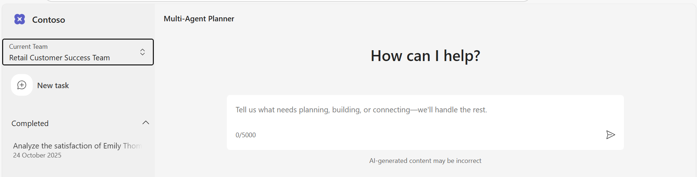

# Sample Questions

To help you get started, here are some **Sample Prompts** you can ask in the app:

## **Teams** 
Select the Team option from the top-left section, then click Continue after choosing the desired team.

By default, three teams are available after running the post-deployment scripts:
- Retail
- HR
- Marketing
  


### **Retail Scenario**
If you select the Retail team, follow the prompts below.

>**Agents Used:** Customer, Order, Analysis Recommendation

The Retail scenario enables users to explore and access information related to the Retail team and its associated data. Key activities include:

_Sample operation:_
- Task: From the Quick Tasks, select **"Satisfaction Plan"** and submit it.
  > _Observe: An analysis of Emily Thompson’s satisfaction with Contoso has been generated. It provides a proposed plan consisting of four or more steps._
- Task: Click **"Approve Task Plan"** Button
  > _Observe: It goes into "Thinking Process", "Processing your plan" and "coordinating with AI Agents"._
  > Review the output.

### **Product Marketing Scenario**
If you select the Marketing team, follow the prompts below.

>**Agents Used:** Product, Marketing , Proxy 

The Product Marketing Scenario allows users to explore and retrieve information related to Marketing and specific product. Key tasks include:

_Sample operation:_
- Task: Switch to **"Product Marketing Team"** from the top left section and click **"Continue"** button.
- Task: From the Quick Tasks, select **"Draft a press release"** and submit it.
  > _Observe: It will trigger the "Generating Plan Action" and Give the Proposed Plan with 4 or more Steps_
- Task: Click on **"Approve Task Plan"** Button
  > _Observe: It goes into "Thinking Process" and observe a spinner "Processing your plan and coordinating with AI Agents" _
  > Review the output.

### **HR Onboaring Scenario**
If you select the HR team, follow the prompts below.

>**Agents Used:** HR Helper, Technical support , Proxy 

The HR Onboaring Scenario allows users to explore and retrieve information related to OnBoarding the Employee. Key tasks include:

_Sample operation:_

- Task: Switch to the **"Human Resources Team"** from the top left section and click **"Continue"**
- Task: From the Quick Tasks, select **"Onboard New Employee"** and submit it.
  
  > _Observe: If it asks for additional clarification (Human in the loop) Please provide this information irrepective of what specific information is asked. This will prevent agent for asking for multiple clarifications_

  ```sh
  department: hr, role: manager, start date: 11/23/2025, orientation date: 11/25/2025, location: onsite, email: js@contoso.com, mentor: Jim Shorts, benefits package:   standard, ID Card: yes, salary: 70000, Laptop : Dell 14 Plus
  ```
  > _Observe: It will trigger "Generating Plan Action" and "Proposed Plan" with 4 or more Steps_
</br>

- Task: Click on **"Approve Task Plan"** Button.
  > _Observe: It goes into "Thinking Process", "Processing your plan" and "coordinating with AI Agents"_
  > Review the output.

  
This structured approach ensures that users receive automated, AI-coordinated task execution and intelligent responses from specialized agents.
